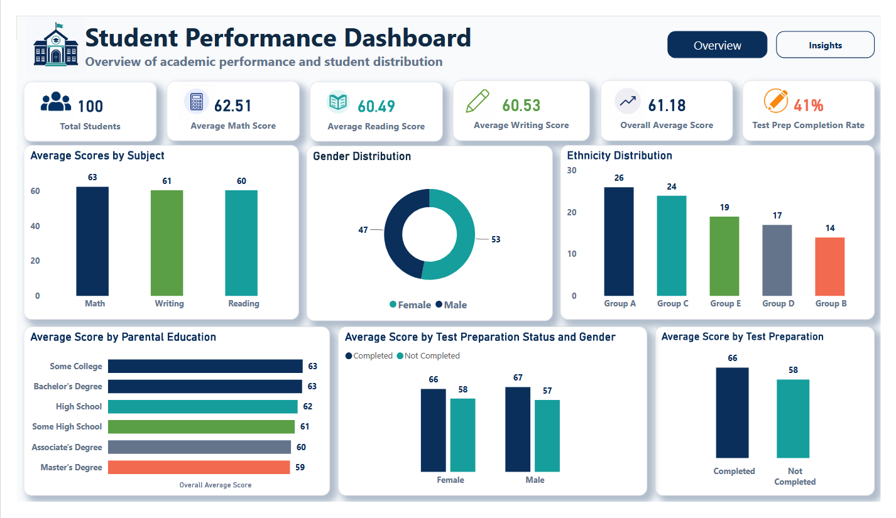
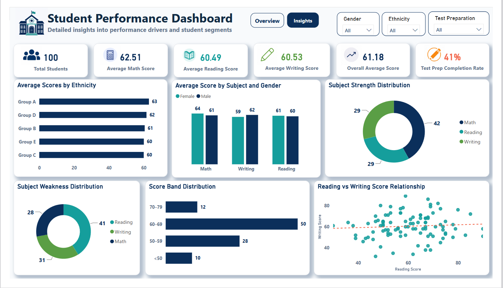

# Student Performance Dashboard

Student Performance Analysis using **Excel** and **Power BI** to explore academic scores, test preparation impact, demographic trends, performance levels, and student learning insights.

---

## Project Overview

This project analyzes student academic performance using a dataset containing student demographics, parental education background, test preparation status, and scores across three subjects: **Math**, **Reading**, and **Writing**.

The goal of this project is to understand how different factors relate to student performance and to present the findings through a clean, professional, and interactive Power BI dashboard.

The analysis focuses on answering questions such as:

- What is the overall academic performance of the students?
- Which subject has the highest and lowest average score?
- How does test preparation affect performance?
- How do gender, ethnicity, and parental education relate to student scores?
- Which subject areas show student strength or weakness?
- What score bands do most students fall into?

---

## Tools Used

| Tool | Purpose |
|---|---|
| Excel | Dataset review, cleaning, and preparation |
| Power BI | Data modeling, DAX measures, dashboard design, and visualization |
| DAX | Calculated columns and measures for performance analysis |
| GitHub | Project documentation and portfolio presentation |

---

## Dataset

The dataset contains **100 student records** and includes the following fields:

| Column | Description |
|---|---|
| Student ID | Unique identifier for each student |
| Gender | Student gender |
| Ethnicity | Student ethnic group |
| Parental Education | Highest education level of the student's parent/guardian |
| Test Preparation | Whether the student completed test preparation |
| Math Score | Student score in Math |
| Reading Score | Student score in Reading |
| Writing Score | Student score in Writing |

---

## Data Cleaning Summary

The dataset was checked before analysis and was found to be clean and suitable for dashboard development.

Cleaning and validation steps included:

- Checked for missing values
- Checked for duplicate records
- Confirmed that each Student ID is unique
- Validated that Math, Reading, and Writing scores are within the correct range of 0–100
- Confirmed that score columns are numeric
- Standardized test preparation labels by replacing `None` with `Not Completed`
- Created calculated columns for total score, average score, performance level, pass/fail status, score band, subject strength, and subject weakness

---

## Calculated Columns Created

The following calculated columns were created in Power BI:

| Calculated Column | Purpose |
|---|---|
| Total Score | Adds Math, Reading, and Writing scores |
| Average Score | Calculates each student's average score |
| Performance Level | Groups students into performance categories |
| Pass/Fail Status | Classifies students as Pass or Fail |
| Test Preparation Status | Replaces `None` with `Not Completed` |
| Subject Strength | Identifies each student's strongest subject |
| Subject Weakness | Identifies each student's weakest subject |
| Score Band | Groups students into score ranges |

---

## Key Measures Created

The following DAX measures were used in the dashboard:

| Measure | Purpose |
|---|---|
| Total Students | Counts all students |
| Average Math Score | Calculates average Math score |
| Average Reading Score | Calculates average Reading score |
| Average Writing Score | Calculates average Writing score |
| Overall Average Score | Calculates overall average performance |
| Pass Rate | Calculates percentage of students who passed |
| Fail Rate | Calculates percentage of students who failed |
| Test Prep Completion Rate | Calculates percentage of students who completed test preparation |
| Male Average Score | Calculates average score for male students |
| Female Average Score | Calculates average score for female students |

---

## Dashboard Pages

The Power BI report contains two dashboard pages:

1. **Overview**
2. **Insights**

---

## Dashboard 1: Overview

The Overview dashboard gives a high-level summary of student academic performance and student distribution.

### Key Metrics

| Metric | Value |
|---|---:|
| Total Students | **100** |
| Average Math Score | **62.51** |
| Average Reading Score | **60.49** |
| Average Writing Score | **60.53** |
| Overall Average Score | **61.18** |
| Test Prep Completion Rate | **41%** |

### Visuals Included

- Average Scores by Subject
- Gender Distribution
- Ethnicity Distribution
- Average Score by Parental Education
- Average Score by Test Preparation Status and Gender
- Average Score by Test Preparation



---

## Dashboard 2: Insights

The Insights dashboard provides deeper analysis into the factors and student segments affecting performance.

### Visuals Included

- Average Scores by Ethnicity
- Average Score by Subject and Gender
- Subject Strength Distribution
- Subject Weakness Distribution
- Score Band Distribution
- Reading vs Writing Score Relationship



---

## Key Findings

### 1. Overall performance is moderate

The overall average score is **61.18**, showing that the student group performed at a moderate level across the three subjects.

### 2. Math has the highest average score

Among the three subjects, Math recorded the highest average score at **62.51**, while Reading and Writing recorded similar averages of **60.49** and **60.53** respectively.

### 3. Test preparation improves performance

Students who completed test preparation performed better than students who did not complete test preparation.

- Completed test preparation average score: **66**
- Not completed test preparation average score: **58**

This shows that test preparation is associated with stronger academic performance.

### 4. Gender distribution is balanced

The dataset contains:

- Female students: **53**
- Male students: **47**

This provides a fairly balanced gender distribution for analysis.

### 5. Ethnicity groups show performance differences

Average scores vary across ethnicity groups. Group A recorded the highest average score, while Group C recorded the lowest among the displayed groups.

### 6. Subject strength and weakness patterns are useful for intervention

The Subject Strength and Subject Weakness visuals help identify where students perform best and where they may need additional support.

- Math appears as the most common subject strength.
- Reading appears as the most common subject weakness.

### 7. Most students fall within the 60–69 score band

The score band distribution shows that most students are concentrated in the **60–69** range, indicating that many students are performing around the middle band rather than at excellent or very low levels.

### 8. Reading and Writing scores show a relationship

The scatter plot shows the relationship between Reading and Writing scores. This helps identify whether students who perform well in Reading also tend to perform well in Writing.

---

## Recommendations

1. **Encourage test preparation completion**  
   Since students who completed test preparation performed better, schools should encourage more students to participate in test preparation programs.

2. **Provide targeted support for weaker subject areas**  
   Subject weakness analysis can help teachers identify students who need additional support in Reading, Writing, or Math.

3. **Monitor students in lower score bands**  
   Students in the `<50` and `50–59` score bands should be prioritized for academic support and intervention.

4. **Review learning gaps by demographic group**  
   Differences across ethnicity and parental education groups should be reviewed carefully to understand possible learning-support gaps.

5. **Strengthen reading and writing development together**  
   Since Reading and Writing are related skills, improvement programs can combine reading comprehension and writing practice.

---

## Project Files

| Resource | Link | Description |
|---|---|---|
| Power BI Dashboard | [Open Dashboard File](dashboard/) | Power BI dashboard file for the project |
| Dataset | [Open Dataset](data/student_performance_data.xlsx) | Student performance dataset used for analysis |
| Dashboard Images | [Open Dashboard Images](images/) | Dashboard screenshots used in the README |
| Full Report | [Open Full PDF Report](report/student_performance_analysis_report.pdf) | Detailed analysis report with findings and recommendations |

---

## Full Report

For a detailed explanation of the data-cleaning process, calculated columns, Power BI measures, dashboard findings, chart interpretations, recommendations, and conclusion, read the full project report:

📄 [View the Full Student Performance Analysis Report](report/student_performance_analysis_report.pdf)

---

## Project Structure

```text
Student-Performance-Dashboard/
│
├── dashboard/
│   └── Student Performance Dashboard.pbix
│
├── data/
│   └── student_performance_data.xlsx
│
├── images/
│   ├── dashboard_overview.png
│   └── dashboard_insights.png
│
├── report/
│   └── student_performance_analysis_report.pdf
│
└── README.md
```

---

## Conclusion

This project demonstrates how student academic data can be transformed into meaningful insights using Excel and Power BI. The dashboard provides a simple but professional view of student performance, test preparation impact, demographic trends, subject strengths, subject weaknesses, and score distribution.

The analysis can support teachers, school administrators, and education stakeholders in identifying learning gaps and making data-informed academic decisions.

---

## Author

**Emmanuel Chibuike Mba**  
Data Analyst | Excel | Power BI/Tableau | SQL Server | Python
